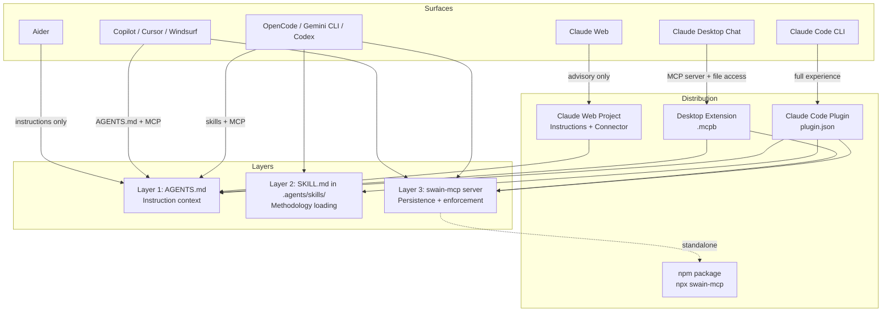

# Swain Everywhere — Architecture Overview

**For:** VISION-003 (Swain Everywhere)
**Date:** 2026-03-18

This document describes how swain works holistically across surfaces — current state, target state, and the path between them. It is descriptive, not decisional. Decisions live in the spike verdicts and operator notes in the portability research report.

---

## Current Architecture

Swain today is a Claude Code-native system. Its components form two interlocking groups: governance (what the agent knows) and execution (what scripts and tools do the work).

**Governance layer**

- `AGENTS.md` encodes swain's instruction hierarchy, artifact model, skill routing rules, and conflict resolution policy. It is a plain markdown file at the repo root, read natively by most modern agent runtimes.
- `CLAUDE.md` (at repo root and `~/.claude/`) provides Claude Code-specific routing. It includes `@AGENTS.md` so that Claude Code ultimately reads the same governance content as other runtimes.
- Skills in `.claude/skills/` and `.agents/skills/` contain the methodology instructions that Claude Code injects as system-prompt-adjacent context when invoked. These include `swain-design`, `swain-do`, `swain-status`, `swain-session`, `swain-doctor`, and the superpowers integration skills.

**Execution layer**

- Bash scripts within each skill directory perform the file operations, git interactions, and state transitions that require deterministic execution rather than model reasoning.
- `specgraph` — a Python package — provides structured queries over the artifact graph: which epics are ready, which specs are complete, dependency ordering, lifecycle position.
- `tk` (ticket) handles task tracking. It is invoked by `swain-do` and stores task state in a local directory.

**Artifact layer**

- Artifacts are markdown files with YAML frontmatter, stored under `docs/` in a directory hierarchy keyed by artifact type and lifecycle phase.
- Lifecycle state lives in the frontmatter (`status`, `phase`). Transitions are performed by skill-guided agent operations, sometimes enforced by script.
- There is no persistent database. Git is the persistence layer for artifact history.

**Coupling and limits**

All three layers above are tightly coupled to Claude Code. Skills work only where Claude Code's skill loading mechanism is active. The bash scripts and `tk` commands only execute in runtimes that support agentic tool calls and shell access. The specgraph queries only run where Python is available and the package is installed. On any other surface, the agent receives the artifact markdown and AGENTS.md governance but none of the enforcement or tooling.

---

## Target Architecture

The target architecture adds two new layers without replacing the current one. The result is a three-layer stack where each layer is independently useful and the full stack is only available on surfaces that can support it.

```
Layer 1: AGENTS.md        — instruction and context (already portable)
Layer 2: .agents/skills/  — skill discovery and methodology (partially portable)
Layer 3: MCP server       — artifact lifecycle, persistence, and orchestration (new)
```

### Layer 1: AGENTS.md (Instruction / Context Layer)

AGENTS.md is already a Linux Foundation open standard with adoption across 60K+ repositories. Every major agent runtime reads it natively: Codex, OpenCode, Cursor, Windsurf, Copilot, Gemini CLI. Claude Code reads it via the `@AGENTS.md` include in CLAUDE.md.

This layer is already complete. Any runtime that reads AGENTS.md receives swain's artifact model, lifecycle rules, and decision-support methodology as contextual guidance. No enforcement, no persistence — but the structured thinking is present.

### Layer 2: .agents/skills/ (Skill Discovery Layer)

SKILL.md is the Agent Skills open standard, supported by 14+ platforms. Swain's `.agents/skills/` directory is the cross-runtime discovery path. On compatible runtimes (OpenCode, Gemini CLI), skill files in this directory are available for invocation as commands.

On Claude Code, these same skills are also available via `.claude/skills/`. The two directories are the same source of truth, not two independent implementations.

This layer provides methodology loading — the instructions for how to execute swain's workflows — on any runtime that implements the SKILL.md standard.

### Layer 3: MCP Server (Persistence / Enforcement Layer)

The `swain-mcp` server is the new component. It provides what the current architecture cannot offer portably: deterministic lifecycle enforcement, persistent artifact state, structured queries, and orchestration.

The MCP server exposes:

- **Tools** — callable functions for artifact operations, lifecycle transitions, state queries, and methodology loading
- **Prompts** — workflow entry points surfaced as slash commands in MCP-compatible clients
- **Resources** — reference materials (definitions, templates, artifact content) available via `@` mention

The server backs its state in SQLite. This provides session persistence across agent conversations — something the current markdown-only architecture cannot guarantee without git commits.

The server is implemented in Python using FastMCP, aligning with the existing specgraph Python package and enabling code reuse between the two.

---

## MCP Server Architecture

### Tools

The swain-mcp server exposes 10–15 tools, kept lean for token budget reasons (a 58-tool MCP setup consumes ~55K tokens before conversation starts).

| Tool | Purpose |
|------|---------|
| `artifact_list` | Query artifacts by type, status, phase, or dependency |
| `artifact_read` | Retrieve the full content of an artifact by ID |
| `artifact_create` | Create a new artifact with type and frontmatter |
| `lifecycle_transition` | Move an artifact between lifecycle phases with gate enforcement |
| `lifecycle_status` | Return the current phase, blockers, and next valid transitions |
| `chart_query` | Query the artifact dependency graph (what's ready, what's blocked) |
| `status_dashboard` | Return the operator's decision-support view (what needs a decision, what's ready) |
| `tk_query` | Query task state for a given artifact |
| `tk_update` | Update task state (claim, complete, block) |
| `load_methodology` | Return the instructional content for a named workflow (portable skill chaining) |

`load_methodology` is the key portability mechanism for skill chaining. On surfaces without native skill loading, calling this tool returns the same instructional content that skill injection would provide in Claude Code. The model receives it as a tool result rather than system-prompt context — lower authority, but frontier models follow it reliably.

### Prompts

MCP Prompts surface as slash commands in MCP-compatible clients. These are the direct portable analog of swain's current skill invocations.

| Prompt | Claude Code equivalent | Purpose |
|--------|----------------------|---------|
| `/mcp__swain__design` | `/swain-design` | Artifact lifecycle management |
| `/mcp__swain__do` | `/swain-do` | Task tracking and execution |
| `/mcp__swain__status` | `/swain-status` | Decision support dashboard |
| `/mcp__swain__session` | `/swain-session` | Session startup and context loading |

### Resources

Resources are reference materials the model can access via `@` mention without a tool call:

| Resource | Content |
|----------|---------|
| `swain://definitions/{type}` | Artifact type definitions and field schemas |
| `swain://templates/{type}` | Creation templates for each artifact type |
| `swain://artifacts/{id}` | The current content of a specific artifact |
| `swain://chart` | The full artifact dependency graph |

### Orchestration Trajectory

Today, the MCP server handles persistence and enforcement; skills handle orchestration. Tool results have lower instruction-following authority than system-prompt-level injection, but in practice frontier models follow tool-returned instructions reliably.

As MCP Sampling with Tools (SEP-1577) gains client support, the server can absorb orchestration responsibilities directly — controlling the agent's context and flow from the server side, without relying on the model to self-direct from tool results. At that point the architecture transitions from hybrid to MCP-primary: skills become thin wrappers or are replaced entirely by MCP Prompts.

---

## Per-Surface Experience



### Claude Code: Full Experience

Claude Code receives all three layers simultaneously, bundled as a Claude Code plugin:

- Layer 1: AGENTS.md governance via `@AGENTS.md` include in CLAUDE.md
- Layer 2: Skills in `.claude/skills/` and `.agents/skills/` with full slash-command invocation, skill chaining, and superpowers integration
- Layer 3: swain-mcp server auto-started by the plugin, providing persistent state and deterministic enforcement alongside skill orchestration

The `plugin.json` manifest bundles the skill directories alongside the MCP server configuration. Installation is a single command; no manual `claude mcp add` required.

### Claude Desktop Chat: MCP + Local Filesystem

The Claude Desktop Chat tab supports Desktop Extensions (`.mcpb` bundles) and MCP servers with local filesystem access. A swain Desktop Extension packages the swain-mcp server. The agent can read and write artifact files on disk, enforce lifecycle transitions, and load methodology via the `load_methodology` tool.

This is a meaningful experience — artifact state is persistent, transitions are enforced, and the operator can interact with a real artifact graph. The gap relative to Claude Code is skill chaining (no native slash commands for swain skills) and superpowers integration. MCP Prompts partially close this gap.

### Claude Web: Advisory Mode

Claude web supports Project Instructions and file uploads (knowledge base), and custom MCP Connectors. It does not support file creation, script execution, or agentic tool loops. Swain's value on Claude web is the decision-support *patterns* — not artifact enforcement.

A swain Project template contains:

- Project Instructions encoding the artifact conventions, lifecycle rules, and decision-support methodology
- Knowledge base files: artifact templates, ADR playbooks, lifecycle reference

If the swain-mcp server is deployed as a remote endpoint, a custom Connector can add artifact state queries (read-only). Write operations are not available in web advisory mode.

### Other Runtimes (OpenCode, Gemini CLI, Codex, Copilot, Cursor, Windsurf)

These runtimes provide varying levels of swain support based on which standards they implement:

- **AGENTS.md** is natively read by all of them — Layer 1 is fully present
- **SKILL.md / .agents/skills/** is supported by OpenCode and Gemini CLI — Layer 2 is present on those two
- **MCP** is supported in production by all of them except Aider — Layer 3 is available via the standalone npm package (`npx swain-mcp`)

For these runtimes, MCP configuration requires a manual setup step (adding the server to the runtime's MCP config). This is a known friction point — a future per-runtime bundle phase could address it if demand warrants.

### Aider: Instructions Only

Aider does not support MCP or a skill extension model. Swain's presence is limited to AGENTS.md in the repository root, which Aider reads as convention files. The operator receives swain's governance rules and artifact model as context. No enforcement, no tooling, no session management.

---

## Distribution Architecture

Swain reaches each surface through a different packaging artifact. The source of truth remains the single canonical repository; each packaging artifact is a projection from it.

### Current: npx skills add

`npx skills add cristoslc/swain` installs swain skills to `.claude/skills/` and `.agents/skills/` from the GitHub repository. This works for Claude Code and any runtime that reads `.agents/skills/`. The MCP server requires a separate manual `claude mcp add` step today.

### Claude Code Plugin (plugin.json)

A `plugin.json` manifest at the repository root bundles:

- The skill directories (`".claude/skills/"`, `".agents/skills/"`)
- The MCP server configuration (command, args, environment)

Installing the plugin auto-starts the MCP server and makes skills available without manual configuration. This is the primary distribution target for Claude Code users. The plugin system is language-agnostic — the manifest specifies the command to run, and the Python-based swain-mcp server works without any TypeScript wrapping.

### Desktop Extension (.mcpb)

A `.mcpb` bundle packages the swain-mcp server for the Claude Desktop Chat tab. This is a zip-like archive containing the server code and a manifest. One-click installation makes the server available in Desktop without manual MCP configuration.

### npm Package (standalone MCP)

Publishing swain-mcp as an npm package enables `npx swain-mcp` as a universal MCP server launcher. Any MCP-compatible client can add it to its server config. This is the fallback distribution path for runtimes that need manual MCP configuration.

### Claude Web Project Template

A shareable Claude web Project template containing Project Instructions and knowledge base files. This is copyable — friends and colleagues can import the template into their own Project without any installation. It does not require the MCP server and works as a pure instructions-based experience.

---

## What Each Layer Adds

| Capability | AGENTS.md only | + SKILL.md | + MCP server |
|-----------|---------------|------------|-------------|
| Artifact model and lifecycle rules | As guidance | As guidance | Enforced |
| Session startup context | Yes | Yes | Yes |
| Workflow invocation (design, do, status) | No | Via slash commands | Via MCP Prompts |
| Skill chaining | No | Yes (Claude Code) | Via load_methodology |
| Artifact state persistence | No | No | Yes (SQLite) |
| Lifecycle transition gates | Advisory | Advisory | Deterministic |
| Dependency graph queries | No | Via specgraph | Via chart_query tool |
| Task tracking | No | Via tk | Via tk_query/tk_update |
| Superpowers integration | No | Yes (Claude Code) | Future (Sampling) |

The design principle throughout: each layer degrades gracefully. A surface with only Layer 1 is still useful — the operator and agent have structured thinking and explicit conventions. Each additional layer adds enforcement and automation without making the lower layers invalid.
