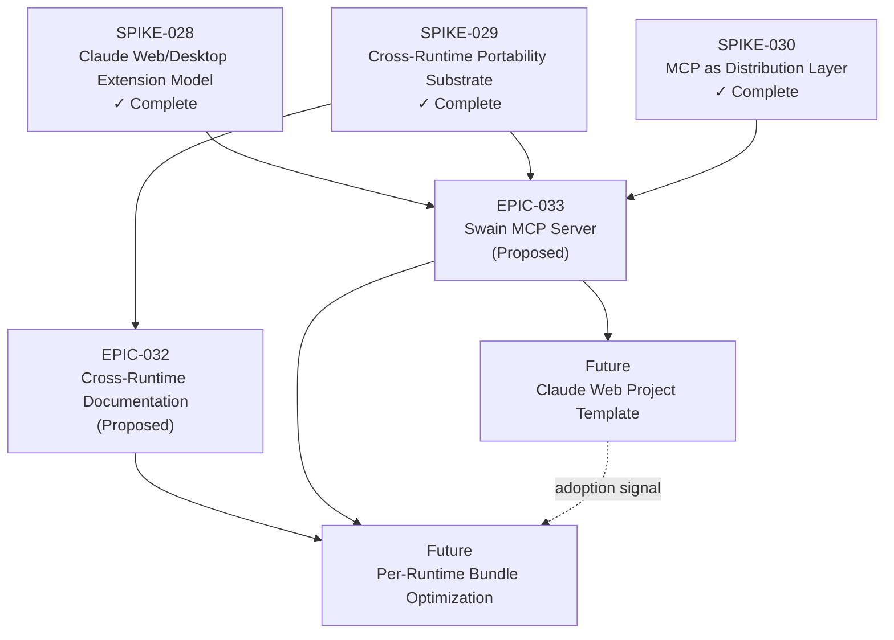

# VISION-003 Roadmap — Swain Everywhere

This document organizes the child epics of VISION-003 into a sequenced delivery plan. It shows dependencies and phase gates. It does not contain calendar dates — sequence and readiness, not schedule.

---

## Epic Status

| Epic | Phase | Goal | Dependencies |
|------|-------|------|--------------|
| EPIC-032 | Proposed | Document cross-runtime compatibility (testing, matrix, quick-start guides) | SPIKE-029 (complete) |
| EPIC-033 | Proposed | Build swain MCP server in Python/FastMCP | SPIKE-028, SPIKE-029, SPIKE-030 (all complete) |
| (Future) Claude Web Project template | — | Package swain's decision-support patterns for Claude web advisory use | EPIC-033 MCP server working |
| (Future) Per-runtime bundle optimization | — | Produce optimized, runtime-specific bundles (Gemini CLI, Copilot, etc.) | EPIC-032 compatibility matrix + EPIC-033 MCP server + adoption signal |

---

## Sequencing

EPIC-032 and EPIC-033 are independent and can proceed in parallel. They serve different purposes and have no mutual dependency.

**EPIC-032 is lighter.** It is primarily documentation and testing work — no new code, no new infrastructure. It verifies what already works (Copilot confirmed; Gemini CLI and OpenCode need retesting on current versions) and produces a compatibility matrix and per-runtime quick-start guides. Low-risk, valuable immediately.

**EPIC-033 is the strategic investment.** It builds the MCP server that becomes swain's core portability asset — the layer that makes swain available to any MCP-compatible client, not just Claude Code CLI. It is higher effort, but its completion unlocks everything after it.

Future epics depend on both:
- The Claude Web Project template becomes more valuable once the MCP server exists (it can optionally connect to a deployed remote endpoint).
- Per-runtime bundle optimization requires both the compatibility knowledge from EPIC-032 and the portable infrastructure from EPIC-033, plus actual adoption signal before investing.

---

## Dependency Graph

---

## Phase Gates

### Phase 1 — EPIC-032 (Cross-Runtime Documentation)

Gate: **all spikes complete.**

- SPIKE-029 (Cross-Runtime Portability Substrate) — done.

Work can begin immediately. No blockers.

Exit criteria: compatibility matrix published, Gemini CLI and OpenCode retested on current versions, per-runtime quick-start guides written.

---

### Phase 2 — EPIC-033 (Swain MCP Server)

Gate: **all spikes complete, implementation language decided.**

- SPIKE-028, SPIKE-029, SPIKE-030 — all done.
- Language decision — **Python** (resolved: FastMCP ergonomics + specgraph reuse).

Work can begin immediately in parallel with EPIC-032. No blockers.

Exit criteria: MCP server exposes artifact CRUD, lifecycle transitions, chart queries, and `load_methodology`; MCP Prompts surface key workflows as slash commands; server bundles as Claude Code plugin and Desktop Extension (.mcpb); artifact state persists via SQLite; lifecycle state machine refuses invalid transitions.

---

### Phase 3 — Claude Web Project Template

Gate: **EPIC-033 MCP server working locally.**

A remote endpoint deployment is not required to start — the Project template (instructions + knowledge base files) can ship first in advisory-only mode. The MCP Connector integration that queries live artifact state requires the server to be deployed as a remote endpoint, which is deferred until local value is proven.

Start this phase when: MCP server is functional locally and the operator confirms Claude web is a surface worth investing in.

---

### Phase 4 — Per-Runtime Bundle Optimization

Gate: **EPIC-032 compatibility matrix complete + EPIC-033 MCP server complete + adoption signal.**

This phase produces first-class swain experiences in specific runtimes (Gemini CLI extension, Copilot plugin, standalone framework documentation). It is explicitly optional — the compatibility matrix from EPIC-032 will identify which runtimes have gaps worth closing, and the MCP server from EPIC-033 provides the infrastructure to fill them. Do not build runtime-specific bundles without evidence that someone (including the operator) will use them.

Trigger: a specific runtime is being used regularly and the generic AGENTS.md + MCP experience is meaningfully worse than it could be with a dedicated bundle.
