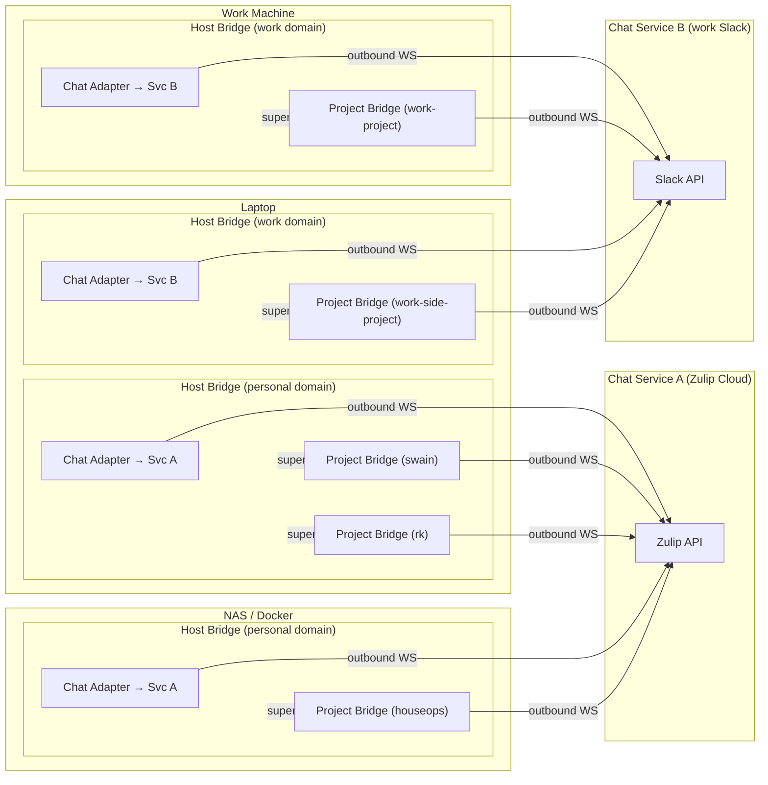

# Untethered Operator — Architecture Overview

**For:** VISION-006 (Untethered Operator)
**Date:** 2026-04-06

This document describes the system architecture using a microkernel pattern with DDD bounded contexts. The kernel (host bridge + project bridge) defines the domain and the plugin contract. Plugins (chat adapters, runtime adapters) are operator-replaceable — we ship reference plugins, but adopters can write their own for any platform without touching the kernel. Individual choices (which chat platform, which runtime) belong in ADRs or operator config.

---

## Two Modalities

The vision serves two interaction surfaces under one infrastructure stack.

**v1: Chat bridge** — bidirectional chat threads that spawn, reconnect to, and steer headless agent sessions across any supported runtime. Room-per-project, thread-per-session, optional artifact binding.

**v2: Web pipe** — project-generated web content (dashboards, static sites, interactive UIs) served from project hosts via tunnel/ingress infrastructure, linked from chat threads. Architecturally independent from the chat bridge. The chat server runs on a VPS and needs no tunnel; the web pipe is where tunnels earn their keep (content lives on the operator's machines).

---

## Bounded Contexts

### Bridge (core domain — two types, shared published language)

The kernel has two bridge types (host and project) connected in a hub-and-spoke topology. The host bridge is the hub — it spawns and supervises project bridges, spawns the shared chat adapter, and routes all events between them. Project bridges never talk to the chat adapter directly.

**Hub-and-spoke:**
```
Chat Adapter ←→ Host Bridge ←→ Project Bridge (swain)
                            ←→ Project Bridge (rk)
                            ←→ Project Bridge (houseops)
```

If the host bridge goes down, all project bridges in that domain stop cleanly. It is unsafe to continue unmonitored agent sessions without the operator's steering surface.

#### Host Bridge (hub)

Local daemon scoped to a security domain on a machine. One host can run multiple host bridges — one per security domain (personal, work, client, etc.). Each host bridge only sees projects in its domain via an include/exclude list.

The host bridge is the **single point of coordination** for its domain. It:
- Spawns and supervises project bridges.
- Spawns the shared chat adapter plugin (one per domain, one bot account).
- Routes events from project bridges to the chat adapter (with bridge ID for room routing).
- Routes commands from the chat adapter to the correct project bridge.
- Polls tmux for unmanaged sessions and posts discovery events through the chat adapter.

**Aggregates:**
- **Domain** — security domain identity, project include/exclude rules, associated chat service.
- **Session inventory** — all tmux sessions on the host (managed and unmanaged), polled continuously.

**Domain events (published language — host scope):**
- `host_status(host_id, bridges_running, disk, load)` — periodic status.
- `unmanaged_session_found(tmux_target, runtime_hint?, project_path?)` — tmux session not owned by any project bridge.
- `unmanaged_session_gone(tmux_target)` — previously reported unmanaged session disappeared.
- `bridge_started(project, bridge_id)` — a project bridge was spawned.
- `bridge_stopped(project, bridge_id, reason)` — a project bridge terminated.

**Domain commands (consumed — host scope):**
- `clone_project(repo_url, host_path?)` — clone a repo onto this host.
- `init_project(project_path)` — initialize swain in an existing project.
- `start_bridge(project_path)` — spawn a project bridge.
- `stop_bridge(project)` — stop a project bridge.
- `adopt_session(tmux_target, project, runtime?, artifact?)` — hand an unmanaged session to a project bridge.

**Ports:**
- **Inbound: Project bridge event port** — receives events from all project bridges in the domain.
- **Inbound: Chat adapter command port** — receives operator commands from the shared chat adapter.
- **Outbound: Chat adapter event port** — forwards events (with bridge ID routing metadata) to the shared chat adapter.
- **Outbound: Project bridge command port** — forwards operator commands to the correct project bridge.
- **Outbound: Session discovery port** — polls tmux sessions on the host.
- **Outbound: Bridge lifecycle port** — spawns/stops project bridges.
- **Outbound: Chat adapter lifecycle port** — spawns the shared chat adapter plugin.

#### Project Bridge (Session Orchestrator)

Manages session lifecycle, artifact binding, and collision detection for one project. Spawned and supervised by the host bridge.

**Aggregates:**
- **Session** — lifecycle state (spawning, active, waiting_approval, idle, dead), runtime binding, optional artifact binding, thread ID.
- **Project** — registered runtimes, active sessions.

**Domain events (published language — project scope):**
- `session_spawned(session_id, runtime, artifact?)` — new session started.
- `text_output(session_id, content)` — runtime produced text.
- `tool_call(session_id, tool_name, input, call_id)` — runtime invoked a tool.
- `tool_result(session_id, call_id, output, success)` — tool returned.
- `approval_needed(session_id, tool_name, description, call_id)` — runtime waiting for operator.
- `session_died(session_id, reason)` — session terminated.
- `web_output_available(session_id, path_or_port, label)` — session produced serveable content.

**Domain commands (consumed — project scope):**
- `start_session(runtime, artifact?, prompt?)` — spawn a new session.
- `send_prompt(session_id, text)` — send operator input.
- `approve(session_id, call_id, approved)` — respond to approval request.
- `cancel(session_id)` — terminate session.
- `bind_artifact(session_id, artifact_id)` — associate session with an artifact.

Project bridges do not talk to the chat adapter directly. They emit events and receive commands through the host bridge, which routes to/from the shared chat adapter. This keeps project bridges simple — they manage sessions and runtimes, nothing else.

**Ports:**
- **Inbound: Host bridge command port** — receives operator commands routed from the host bridge.
- **Inbound: Runtime event port** — receives normalized events from runtime adapters.
- **Outbound: Host bridge event port** — publishes domain events to the host bridge (which forwards to the chat adapter).
- **Outbound: Runtime command port** — sends commands to runtime adapters.
- **Outbound: Session management port** — creates/destroys/reconnects tmux sessions.
- **Outbound: Ingress registration port (v2)** — registers/deregisters session-scoped web routes. Not needed for v1.

---

### Runtime Adapter (plugin — operator-replaceable)

A plugin that translates between a specific runtime's native I/O and the kernel's published language. One per runtime type. Lives on the project host, wraps tmux/process. Based on the adapter interface designed in SPIKE-059 and the ACP protocol (Python SDK available).

**Plugin contract:** A runtime adapter must implement:
- **Inbound: Command port** — receives normalized commands from the kernel.
- **Outbound: Event port** — emits normalized events to the kernel.
- **Outbound: Process port** — manages the actual runtime process (stdin/stdout, headless JSON streams).

**Reference plugins (shipped):**
- Claude Code (`--output-format stream-json`, `--input-format stream-json`).
- OpenCode (`--format json`).
- ACP-generic (any runtime implementing the Agent Communication Protocol — Python SDK `agent-client-protocol`).

**Community plugins (operator-written):**
- Any runtime with headless or structured output can be a plugin. TUI-only runtimes need a regex pattern-matching adapter (higher effort, lower reliability).

---

### Chat Adapter (plugin — operator-replaceable)

A plugin that translates between the kernel's published language and a specific chat platform. One per chat surface. The operator chooses which plugin to use — we ship reference plugins, adopters can write their own.

**Plugin contract:** A chat adapter must implement:
- **Inbound: Domain event port** — receives events from the kernel for display.
- **Inbound: Chat message port** — receives operator messages from the chat platform.
- **Outbound: Domain command port** — sends parsed commands to the kernel.
- **Outbound: Chat API port** — posts messages, creates rooms/threads on the chat platform.

**Reference plugins (shipped):**
- Zulip (via Zulip bot API — streams as rooms, topics as threads).
- Additional reference plugins TBD based on trove research (Telegram, Slack, Discord are candidates).

**Community plugins (operator-written):**
- Any platform with a bot API and some form of rooms + threads can be a plugin. The operator implements the contract, points config at it, done.

**Posting behavior:** The chat adapter posts continuously as events arrive — tool calls, text output, progress. The thread is a live feed, not a request-response channel. The adapter `@`s the operator only when the orchestrator emits `approval_needed` or other events requiring human input. The operator checks in by reading, not by asking.

**Graceful failure:** When the runtime produces an interaction the bridge doesn't recognize (new prompt format, unexpected TUI state), the chat adapter surfaces a warning in the thread — not a fatal error. The operator can intervene manually (kill and restart via the control thread) or the bridge can time out and report the stuck state.

**Concept mapping (each plugin maps these to its platform's primitives):**

| Kernel concept | Zulip | Telegram | Slack | Matrix |
|----------------|-------|----------|-------|--------|
| Project container | Stream | Forum supergroup | Channel | Space or Room |
| Session container | Topic | Forum topic | Thread | Thread (MSC3440) |
| Control thread | Pinned topic | Pinned topic | Pinned thread | Pinned thread |
| Artifact binding | Topic name | Topic name | Thread metadata | Thread metadata |

**Control thread:** Each project room has a dedicated control thread where the host bridge posts session inventory (active, adoptable, stuck) and accepts lifecycle commands (spawn, kill, restart, adopt). This is the operator's management surface for the project — distinct from per-session live feed threads. The host bridge's chat adapter posts here; the project bridge's chat adapter posts to session threads.

---

### Chat Service (external system)

Not our domain logic. Either a hosted platform (Zulip Cloud, Slack, Discord) or a self-hosted server on a VPS. Shared by default across projects. Isolated (separate instance or workspace) when security demands it.

**Responsibilities:** Message routing, auth, mobile/desktop client support, message persistence, room/thread management.

**What we need from it:** A bot API (create rooms, post messages, read messages, manage threads), mobile clients, reasonable rate limits for continuous bot posting.

**Deployment options (ordered by ops burden):**
1. **Hosted platform (default for v1).** Zulip Cloud, Slack, etc. Zero server ops. The `/swain-stage` provisioning command registers a bot via the platform's API and connects bridges. The operator already has the mobile app installed. Zulip Cloud is notable because its API is identical to self-hosted — migration is seamless.
2. **Self-hosted on VPS.** For operators who need full control or have privacy constraints. Chat server (containerized) + Caddy for TLS on a small VPS. DNS points to the VPS. Bridges connect outbound.

The chat adapter code is identical in both cases — it speaks to an API regardless of where the server lives.

---

### Ingress Layer (v2 only — not needed for v1 chat bridge)

The chat server runs on a VPS with a public IP. No tunnel or ingress layer is needed for v1. Bridges connect outbound over open internet. The operator's phone reaches the chat server directly.

The ingress layer becomes relevant in v2 when the web pipe needs to expose content from project hosts (which sit behind NAT on home networks, Docker hosts, etc.). At that point, tunnels from project hosts to a reverse proxy make session-scoped previews reachable.

**Candidate: Commodore (cristoslc/commodore-infra).** Commodore handles service composition, DNS, ingress, reverse proxy, and classified placement. It needs one new adapter (`TunnelPort` for Cloudflare Tunnel) to cover the full v2 ingress chain. If Commodore is used, this bounded context is consumed, not built.

**v2 consumers:**
- **Session-scoped web outputs** — tunneled from project hosts, auto-deregistered on session end.
- **Long-lived web services** — persistent, independent of any session.

---

### Web App (separate bounded context, v2)

Independent from the session orchestrator. Reads project data directly (artifacts, tk, filesystem, MCP server). Serves rendered content. Reaches the internet via the v2 ingress layer (tunnel from project host).

The only connection to v1: the chat adapter may post a URL linking to the web app's output. This is a message, not an architectural coupling.

---

## Context Map

```
Runtime Adapter (plugin) ←──conformist──→ Project Bridge (kernel)
    (plugin conforms to kernel's published language)

Chat Adapter (plugin) ←──conformist──→ Bridge (kernel, host or project)
    (plugin conforms to kernel's published language — same contract, either bridge type)

Chat Adapter (plugin) ←──customer/supplier──→ Chat Service (external)
    (plugin is customer of chat platform's API)

Host Bridge (kernel) ←──supervisor──→ Project Bridge (kernel)
    (host bridge spawns, stops, and hands adopted sessions to project bridges)

Web App ←──(none)──→ Project Bridge
    (no direct relationship)

Web App ←──open-host──→ Project Data
    (reads artifact graph, tk, filesystem)

Ingress Layer (v2) ←──shared-kernel──→ Web App
    (shared DNS, TLS, tunnel routing — not needed for v1 chat)
```

---

## Plugin Loading

Plugins are executables that speak NDJSON over stdio. The kernel spawns each plugin as a child process. Language-agnostic — write plugins in Python, Go, Rust, Node, shell, whatever.

```yaml
# Example host bridge config
chat:
  command: /usr/local/bin/swain-chat-zulip
  sha256: a1b2c3d4e5f6...
  config:
    server_url: https://myorg.zulipchat.com
    bot_email: swain-bot@myorg.zulipchat.com
    bot_api_key: ${ZULIP_BOT_API_KEY}

runtimes:
  claude:
    command: /usr/local/bin/swain-runtime-claude
    sha256: f6e5d4c3b2a1...
    config:
      allowed_tools: ["Bash", "Read", "Write", "Edit"]
  opencode:
    command: /usr/local/bin/swain-runtime-opencode
    sha256: 1a2b3c4d5e6f...
```

**Protocol:** The kernel passes config as the first JSON line on stdin. Then events and commands stream as NDJSON in both directions. Events from the kernel include a `bridge` field for routing (which project the event belongs to). Commands from the chat adapter include the same field so the kernel routes to the correct project bridge.

**Security:**
- **Stdio is process-locked.** The pipe exists only between the kernel and its child. No network port, no socket to hijack.
- **Absolute paths + SHA-256 pinning.** Config uses full paths to executables with content hashes. The kernel checks the hash before spawning. Catches path hijacking and tampering.
- **Config file permissions.** The config contains credentials and plugin paths. Owner-readable only (`chmod 600`). The host bridge refuses to start if permissions are too open.
- **Scoped config.** Each plugin receives only its own credentials. Chat adapters never see runtime credentials. Runtime adapters never see chat credentials.

**Plugin distribution:** Package-manager-agnostic. Any executable on `$PATH` or at an absolute path.
- `brew install swain-chat-zulip` (Go binary).
- `cargo install swain-chat-slack` (Rust binary).
- `npx swain-chat-discord` (Node).
- `uv tool install swain-chat-telegram` (Python).
- Or a script in `~/.local/bin/`.

**Future option:** MCP as the plugin protocol. Instead of raw NDJSON, plugins speak MCP over stdio. This adds capability negotiation and tool schemas. Deferred — raw NDJSON is sufficient for v1.

---

## Deployment Topology

Chat services and project hosts are decoupled. Project bridges connect outbound to their chat service via chat adapters. Chat services never initiate connections to bridges. Multiple chat services can coexist — hosted or self-hosted. Host bridges are scoped to security domains, not machines — one host can run multiple host bridges.



The laptop runs two host bridges — one for the personal security domain (→ Chat Service A), one for the work domain (→ Chat Service B). Each host bridge only sees and manages projects in its domain.

**Deployment modes:**

- **Default (hosted):** Shared hosted chat platform (Zulip Cloud, Slack, etc.), per-project bridges on project hosts. `/swain-stage` registers a bot on the platform, creates a room/stream, and starts the host bridge + project bridge locally. No server provisioning needed.
- **Self-hosted:** Chat server on a VPS for operators who need full control. `/swain-stage` provisions the VPS, deploys the chat server (containerized) + Caddy, and connects bridges.
- **Isolated:** Separate chat service instance (or workspace/organization) for security-sensitive projects or work contexts. Works with both hosted and self-hosted.

---

## Data Flow

### Operator sends a prompt from phone

```
Phone → Chat app → Chat service → Chat adapter
    → Host bridge (routes by room → project bridge)
    → Project bridge (resolves thread → session)
    → Runtime adapter (denormalizes to runtime-specific input)
    → Runtime (headless CLI in tmux)
```

### Runtime produces output

```
Runtime → Runtime adapter (normalizes to domain event)
    → Project bridge (enriches with session context)
    → Host bridge (forwards with bridge ID)
    → Chat adapter (formats as chat message, posts to correct room/thread)
    → Chat service → Chat app → Phone
```

### Operator starts a new session

```
Phone: "/work SPEC-142" in project room
    → Chat adapter parses command, includes room → bridge routing
    → Host bridge routes to project bridge
    → Project bridge checks session registry for SPEC-142 binding
    → If found: reconnects thread to existing session
    → If not found: spawns new tmux session, starts runtime, binds artifact
    → Project bridge emits session_spawned → Host bridge → Chat adapter
    → Chat adapter creates thread, posts "Session started on SPEC-142"
```

### Operator adopts a terminal session

```
Host bridge polls tmux → finds unmanaged session "swain-spec-142"
    → Host bridge emits unmanaged_session_found → Chat adapter
    → Chat adapter posts to control thread in project room
Operator sees listing, replies "adopt swain-spec-142"
    → Chat adapter → Host bridge routes adopt_session to project bridge
    → Project bridge attaches runtime adapter to tmux session
    → Project bridge emits session_spawned → Host bridge → Chat adapter
    → Chat adapter creates new thread, begins posting live feed
```

### Operator clones a new project from phone

```
Phone: "clone cristoslc/some-repo" in host room
    → Chat adapter → Host bridge receives clone_project command
    → Host bridge clones repo, inits swain
    → Host bridge spawns project bridge
    → Host bridge emits bridge_started → Chat adapter
    → Chat adapter creates project room on chat service
    → Chat adapter posts "Project some-repo ready" with link to room
```

### Session-scoped web output (v1 bridge to v2)

```
(v2 — requires tunnel/ingress from project host)
Runtime builds Astro site → Runtime adapter emits event
    → Orchestrator receives web_output_available
    → Orchestrator registers route on ingress layer (session-scoped tunnel)
    → Orchestrator emits event to chat adapter
    → Chat adapter posts "Preview ready: https://project.example.com/preview"
    → Session ends → Orchestrator deregisters route
```

---

## Key Architectural Decisions

These are observations about what the architecture requires, not ADR-level decisions. The ADRs will record the specific choices made.

1. **Outbound-only from project hosts.** All connections are initiated by the host. Chat adapters on bridges connect outbound to the chat service. The chat service never opens connections to bridges. Same security model as Claude Code Remote Control.
2. **Microkernel architecture.** The kernel (host bridge + project bridge) defines the domain and the plugin contract (published language). Chat adapters and runtime adapters are plugins — operator-replaceable, independently installable. We ship reference plugins; adopters write their own for any platform. 2 bridge types × N chat plugins = 2N permutations, only 2 + N components to write.
3. **Host bridge is scoped to a security domain, not a physical host.** One host can run multiple host bridges — one per security domain (e.g., personal, work, client-A). Each host bridge only sees and manages project bridges in its domain. An include/exclude list determines which projects belong to which domain. This prevents a single host bridge from having cross-domain visibility.
4. **Plugins are Python modules (v1), MCP servers (future option).** v1 uses Python base classes for simplicity. The kernel loads plugins by config. Future: MCP as plugin protocol enables language-agnostic plugins.
5. **Hosted chat platform by default, self-hosted as an option.** The simplest v1 path uses a hosted platform (Zulip Cloud, Slack) — zero server ops. Self-hosting on a VPS is available for operators who need full control. The chat adapter code is identical either way. Tunnels are a v2 concern for the web pipe (content on project hosts behind NAT).
6. **Multiple chat services can coexist.** Personal and work chat services are separate VPS instances. Each project bridge connects to exactly one. Each host bridge connects to exactly one (matching its security domain).
7. **Session-scoped web outputs go through the project bridge (v2).** Long-lived web services register with the ingress layer independently. Two paths, intentionally not unified. Both require tunnel infrastructure from project hosts — a v2 problem.
8. **One project bridge per project-host pair.** A project on two hosts gets two project bridges sharing the same chat room. One or more host bridges per host, one per security domain.

---

## Open Questions (for child artifacts)

Documented in [child-artifacts.md](child-artifacts.md). Key questions:

- Which chat server? (Trove research → ADR.)
- Chat adapter deployment location — colocated with orchestrator on project host, or elsewhere? (ADR.)
- Session persistence and recovery after host restart. (Spike.)
- Chat bot topology — how many adapters, where do they run? (Design.)
- Orchestrator event schema — full specification of the published language. (Design.)
- Provisioning UX — what `/swain` commands exist and what do they automate? (Spec.)
