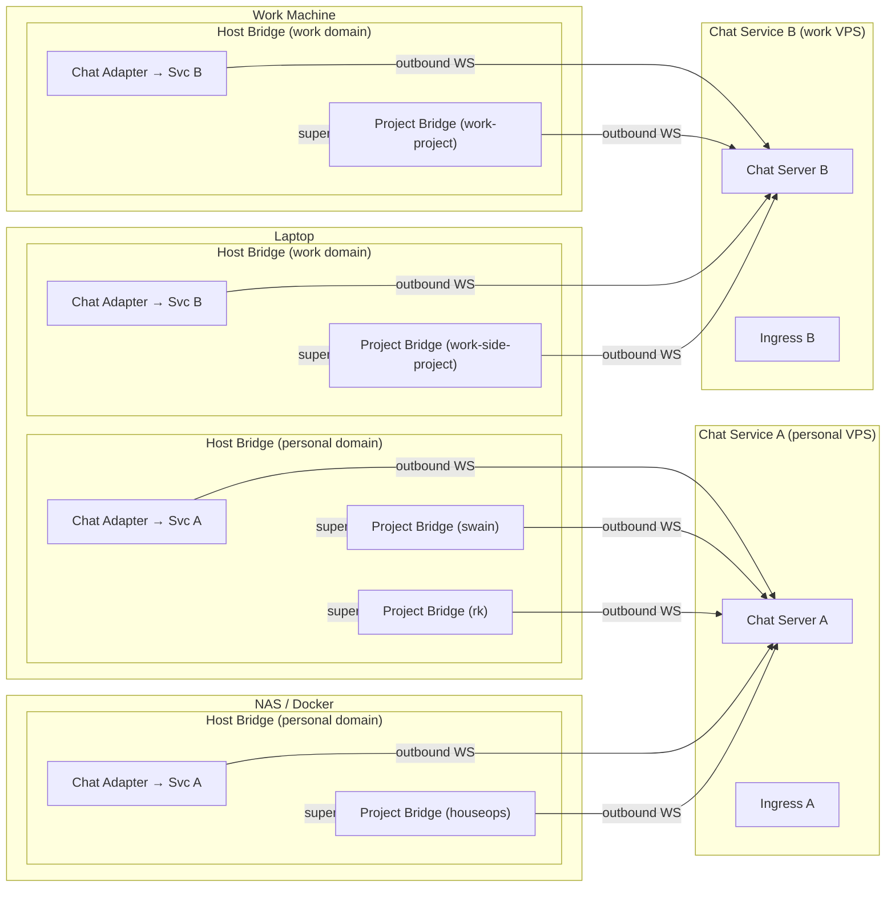

# Untethered Operator — Architecture Overview

**For:** VISION-006 (Untethered Operator)
**Date:** 2026-04-06

This document describes the system architecture using Domain-Driven Design bounded contexts and ports-and-adapters patterns. It is descriptive, not decisional. Individual choices (which chat server, which tunnel provider) belong in ADRs.

---

## Two Modalities

The vision serves two interaction surfaces under one infrastructure stack.

**v1: Chat bridge** — bidirectional chat threads that spawn, reconnect to, and steer headless agent sessions across any supported runtime. Room-per-project, thread-per-session, optional artifact binding.

**v2: Web pipe** — project-generated web content (dashboards, static sites, interactive UIs) served through the same ingress infrastructure the chat server uses, linked from chat threads. Architecturally independent from the chat bridge. Shares only the ingress layer.

---

## Bounded Contexts

### Bridge (core domain — two types, shared published language)

Two bridge types share a common event/command language so that any chat adapter works with either. The chat adapter is generic — it renders events and routes commands regardless of which bridge type it's paired with.

**2 bridge types × N chat adapters = 2N permutations, but only 2 + N components to write.**

#### Host Bridge

Local daemon scoped to a security domain on a machine. One host can run multiple host bridges — one per security domain (personal, work, client, etc.). Each host bridge only sees projects in its domain via an include/exclude list. Does not connect to the network directly — its chat adapter handles that.

**Aggregates:**
- **Domain** — security domain identity, project include/exclude rules, associated chat service.
- **Session inventory** — all tmux sessions on the host (managed and unmanaged), polled continuously.

**Domain events (published language — host scope):**
- `host_status(host_id, bridges_running, disk, load)` — periodic status.
- `unmanaged_session_found(tmux_target, runtime_hint?, project_path?)` — tmux session not owned by any project bridge.
- `unmanaged_session_gone(tmux_target)` — previously reported unmanaged session disappeared.
- `bridge_started(project, bridge_id)` — a project bridge was spawned.
- `bridge_stopped(project, bridge_id, reason)` — a project bridge terminated.

**Domain commands (consumed — host scope):**
- `clone_project(repo_url, host_path?)` — clone a repo onto this host.
- `init_project(project_path)` — initialize swain in an existing project.
- `start_bridge(project_path, chat_service)` — spawn a project bridge and connect it.
- `stop_bridge(project)` — stop a project bridge.
- `adopt_session(tmux_target, project, runtime?, artifact?)` — hand an unmanaged session to a project bridge.

**Ports:**
- **Inbound: Chat port** — receives host-level commands from chat adapters.
- **Outbound: Chat delivery port** — publishes host events to chat adapters.
- **Outbound: Session discovery port** — polls tmux sessions on the host.
- **Outbound: Bridge lifecycle port** — spawns/stops project bridges.

#### Project Bridge (Session Orchestrator)

Manages session lifecycle, artifact binding, and collision detection for one project. Spawned and supervised by the host bridge.

**Aggregates:**
- **Session** — lifecycle state (spawning, active, waiting_approval, idle, dead), runtime binding, optional artifact binding, thread ID.
- **Project** — registered runtimes, active sessions.

**Domain events (published language — project scope):**
- `session_spawned(session_id, runtime, artifact?)` — new session started.
- `text_output(session_id, content)` — runtime produced text.
- `tool_call(session_id, tool_name, input, call_id)` — runtime invoked a tool.
- `tool_result(session_id, call_id, output, success)` — tool returned.
- `approval_needed(session_id, tool_name, description, call_id)` — runtime waiting for operator.
- `session_died(session_id, reason)` — session terminated.
- `web_output_available(session_id, path_or_port, label)` — session produced serveable content.

**Domain commands (consumed — project scope):**
- `start_session(runtime, artifact?, prompt?)` — spawn a new session.
- `send_prompt(session_id, text)` — send operator input.
- `approve(session_id, call_id, approved)` — respond to approval request.
- `cancel(session_id)` — terminate session.
- `bind_artifact(session_id, artifact_id)` — associate session with an artifact.

The chat adapter surfaces session events as a live feed in per-session threads. The operator reads passively and types only to steer. The host bridge handles session discovery and adoption — the project bridge receives already-adopted sessions.

**Ports:**
- **Inbound: Chat port** — receives operator commands from chat adapters. The connection is outbound-initiated (bridge connects to chat service), but the protocol is bidirectional: events stream out, commands flow in over the same connection.
- **Inbound: Runtime event port** — receives normalized events from runtime adapters.
- **Inbound: Host bridge port** — receives adopted sessions from the host bridge.
- **Outbound: Chat delivery port** — publishes domain events to chat adapters.
- **Outbound: Runtime command port** — sends commands to runtime adapters.
- **Outbound: Session management port** — creates/destroys/reconnects tmux sessions.
- **Outbound: Ingress registration port** — registers/deregisters session-scoped web routes. Route lifecycle follows session lifecycle.

---

### Runtime Adapter (integration context — runtime side)

Dumb translator. One per runtime type. Lives on the project host, wraps tmux/process.

**Responsibility:** Translates between a specific runtime's native I/O and the orchestrator's published event/command language. Based on the adapter interface designed in SPIKE-059.

**Ports:**
- **Inbound: Command port** — receives normalized commands from orchestrator.
- **Outbound: Event port** — emits normalized events to orchestrator.
- **Outbound: Process port** — manages the actual runtime process (stdin/stdout, headless JSON streams).

**Adapters (one per runtime):**
- Claude Code (`--output-format stream-json`, `--input-format stream-json`).
- OpenCode (`--format json`).
- Gemini CLI (`--output-format json`).
- TUI fallback (regex pattern matching for terminal-only runtimes).

---

### Chat Adapter (integration context — operator side)

Pluggable translator. One per chat surface. Location flexible — wherever it can reach both the chat service and the orchestrator.

**Responsibility:** Maps domain events to chat messages and chat messages to domain commands. Maps projects to rooms, sessions to threads. Handles room creation when a new project registers.

**Ports:**
- **Inbound: Domain event port** — receives events from orchestrator for display.
- **Inbound: Chat message port** — receives operator messages from the chat service.
- **Outbound: Domain command port** — sends parsed commands to orchestrator.
- **Outbound: Chat API port** — posts messages, creates rooms/threads on the chat service.

**Adapters (one per chat protocol):**
- Matrix (via matrix-nio, maubot, or similar).
- Zulip (via Zulip bot API).
- Campfire (via Campfire API — rooms only, no threads).
- Others as needed.

**Posting behavior:** The chat adapter posts continuously as events arrive — tool calls, text output, progress. The thread is a live feed, not a request-response channel. The adapter `@`s the operator only when the orchestrator emits `approval_needed` or other events requiring human input. The operator checks in by reading, not by asking.

**Graceful failure:** When the runtime produces an interaction the bridge doesn't recognize (new prompt format, unexpected TUI state), the chat adapter surfaces a warning in the thread — not a fatal error. The operator can intervene manually (kill and restart via the control thread) or the bridge can time out and report the stuck state.

**Chat-protocol-specific mapping:**

| Concept | Matrix | Zulip | Campfire |
|---------|--------|-------|----------|
| Project container | Space or Room | Stream | Room |
| Session container | Thread | Topic | Message thread (limited) |
| Control thread | Pinned thread in room | Pinned topic | Pinned message (limited) |
| Artifact binding | Thread metadata | Topic name | N/A |

**Control thread:** Each project room has a dedicated control thread where the host bridge posts session inventory (active, adoptable, stuck) and accepts lifecycle commands (spawn, kill, restart, adopt). This is the operator's management surface for the project — distinct from per-session live feed threads. The host bridge's chat adapter posts here; the project bridge's chat adapter posts to session threads.

---

### Chat Service (external system)

Not our domain logic. An off-the-shelf self-hostable chat server. Shared by default across projects. Isolated (dedicated instance) when security demands it.

**Responsibilities:** Message routing, auth, mobile/desktop client support, message persistence, room/thread management.

**What we need from it:** A bot API (create rooms, post messages, read messages, manage threads), mobile clients, self-hostable, reasonable resource footprint.

---

### Ingress Layer (shared infrastructure)

Routes external traffic to internal services. Provisions and maintains DNS, TLS, and tunnel.

**Candidate: Commodore (cristoslc/commodore-infra).** Commodore is an existing hexagonal infrastructure platform that handles service composition, DNS, ingress, reverse proxy, and classified placement across heterogeneous hosts (Docker, k3s, bare metal, Proxmox). Its ports-and-adapters architecture aligns directly with this layer's needs. The chat server, bridges, and web apps would be declared as Commodore services and deployed via `cdre apply`. Commodore already has adapters for DNS (Cloudflare), reverse proxy (Caddy, HAProxy), and container runtimes (Docker Compose).

If Commodore is used, this bounded context is not built — it's consumed.

**Ports (if built standalone):**
- **Inbound: Public traffic port** — accepts HTTPS from the internet.
- **Outbound: Backend port** — forwards to registered backends.
- **Outbound: Provisioning port** — manages DNS records, certificates, tunnel lifecycle.

**Adapters:**
- Reverse proxy: Caddy, nginx, traefik.
- Tunnel: Cloudflare Tunnel, Tailscale Funnel, TMNT/Mutagen, ngrok.
- DNS: Cloudflare API, Route53, manual.
- Cert: Let's Encrypt via proxy, or provided cert.

**Consumers (v1):** Chat service.
**Consumers (v2):** Chat service + web apps.

Route registrations come from two sources:
- **Session orchestrator** — session-scoped routes, auto-deregistered on session end.
- **Long-lived web services** — self-registered, persistent, independent of any session.

---

### Web App (separate bounded context, v2)

Independent from the session orchestrator. Reads project data directly (artifacts, tk, filesystem, MCP server). Serves rendered content. Registered as a backend on the ingress layer.

The only connection to v1: the chat adapter may post a URL linking to the web app's output. This is a message, not an architectural coupling.

---

## Context Map

```
Runtime Adapter ←──conformist──→ Project Bridge
    (conforms to bridge's event/command schema)

Chat Adapter ←──conformist──→ Bridge (host or project)
    (conforms to bridge's event/command schema — same adapter, either bridge type)

Chat Adapter ←──customer/supplier──→ Chat Service
    (adapter is customer of chat service's API)

Host Bridge ←──supervisor──→ Project Bridge
    (host bridge spawns, stops, and hands adopted sessions to project bridges)

Web App ←──(none)──→ Project Bridge
    (no direct relationship)

Web App ←──open-host──→ Project Data
    (reads artifact graph, tk, filesystem)

Ingress Layer ←──shared-kernel──→ Chat Service, Web App
    (shared DNS, TLS, routing config)
```

---

## Deployment Topology

Chat services and project hosts are decoupled. Project bridges connect outbound to their chat service via chat adapters. Chat services never initiate connections to bridges. Multiple chat services can coexist — each with its own ingress, or sharing one. Host bridges are scoped to security domains, not machines — one host can run multiple host bridges.



The laptop runs two host bridges — one for the personal security domain (→ Chat Service A), one for the work domain (→ Chat Service B). Each host bridge only sees and manages projects in its domain.

**Deployment modes:**

- **Default:** Shared chat service, per-project bridges. The `/swain` provisioning command registers a new bridge and creates a room on the existing chat service.
- **Isolated chat service:** A separate chat service instance for security-sensitive projects or work contexts. Full parallel stack with its own ingress, or registered as a backend on a shared ingress.
- **Shared ingress, separate chat services:** Two chat services behind one ingress provider (e.g., same Commodore deployment, different subdomains). Bridges on each host connect to whichever chat service their project belongs to.
- **First-project bootstrap:** Provisions the full stack — chat service, ingress, tunnel, DNS, TLS, bridge.

---

## Data Flow

### Operator sends a prompt from phone

```
Phone → Chat app → Chat service → Chat adapter
    → Session orchestrator (resolves thread → session)
    → Runtime adapter (denormalizes to runtime-specific input)
    → Runtime (headless CLI in tmux)
```

### Runtime produces output

```
Runtime → Runtime adapter (normalizes to domain event)
    → Session orchestrator (enriches with session context)
    → Chat adapter (formats as chat message)
    → Chat service → Chat app → Phone
```

### Operator starts a new session

```
Phone: "/work SPEC-142"
    → Chat adapter parses command
    → Orchestrator checks session registry for SPEC-142 binding
    → If found: reconnects thread to existing session
    → If not found: spawns new tmux session, starts runtime, binds artifact
    → Chat adapter creates thread, posts "Session started on SPEC-142"
```

### Operator adopts a terminal session

```
Host bridge polls tmux → finds unmanaged session "swain-spec-142"
    → Host bridge emits unmanaged_session_found
    → Host chat adapter posts to status thread in host room
Operator sees listing, replies "adopt swain-spec-142 to swain project"
    → Host bridge routes adopt_session to swain project bridge
    → Project bridge attaches runtime adapter to tmux session
    → Project chat adapter creates new thread, begins posting live feed
```

### Operator clones a new project from phone

```
Phone: "clone cristoslc/some-repo" in host room
    → Host chat adapter parses clone_project command
    → Host bridge clones repo, inits swain
    → Host bridge spawns project bridge + chat adapter
    → Project chat adapter creates project room on chat service
    → Host bridge emits bridge_started
    → Host chat adapter posts "Project some-repo ready" with link to room
```

### Session-scoped web output (v1 bridge to v2)

```
Runtime builds Astro site → Runtime adapter emits event
    → Orchestrator receives web_output_available
    → Orchestrator registers route on ingress layer (session-scoped)
    → Orchestrator emits event to chat adapter
    → Chat adapter posts "Preview ready: https://project.example.com/preview"
    → Session ends → Orchestrator deregisters route
```

---

## Key Architectural Decisions

These are observations about what the architecture requires, not ADR-level decisions. The ADRs will record the specific choices made.

1. **Outbound-only from project hosts.** All connections are initiated by the host. Chat adapters on bridges connect outbound to the chat service. The chat service never opens connections to bridges. Same security model as Claude Code Remote Control.
2. **Two bridge types, one published language.** Host bridges and project bridges share an event/command schema. Chat adapters are generic — they pair with either bridge type. 2 bridge types × N chat adapters = 2N permutations, only 2 + N components to write.
3. **Host bridge is scoped to a security domain, not a physical host.** One host can run multiple host bridges — one per security domain (e.g., personal, work, client-A). Each host bridge only sees and manages project bridges in its domain. An include/exclude list determines which projects belong to which domain. This prevents a single host bridge from having cross-domain visibility.
4. **Chat protocol is a pluggable adapter.** Swapping from Matrix to Zulip replaces the chat adapter and chat service. Bridges don't change.
5. **Multiple chat services can coexist.** Personal and work chat services are separate instances. They may share an ingress provider or each have their own. Each project bridge connects to exactly one chat service. Each host bridge connects to exactly one chat service (matching its security domain).
6. **Session-scoped web outputs go through the project bridge.** Long-lived web services register with the ingress layer independently. Two paths, intentionally not unified.
7. **One project bridge per project-host pair.** A project on two hosts gets two project bridges sharing the same chat room. One or more host bridges per host, one per security domain.

---

## Open Questions (for child artifacts)

Documented in [child-artifacts.md](child-artifacts.md). Key questions:

- Which chat server? (Trove research → ADR.)
- Chat adapter deployment location — colocated with orchestrator on project host, or elsewhere? (ADR.)
- Session persistence and recovery after host restart. (Spike.)
- Chat bot topology — how many adapters, where do they run? (Design.)
- Orchestrator event schema — full specification of the published language. (Design.)
- Provisioning UX — what `/swain` commands exist and what do they automate? (Spec.)
