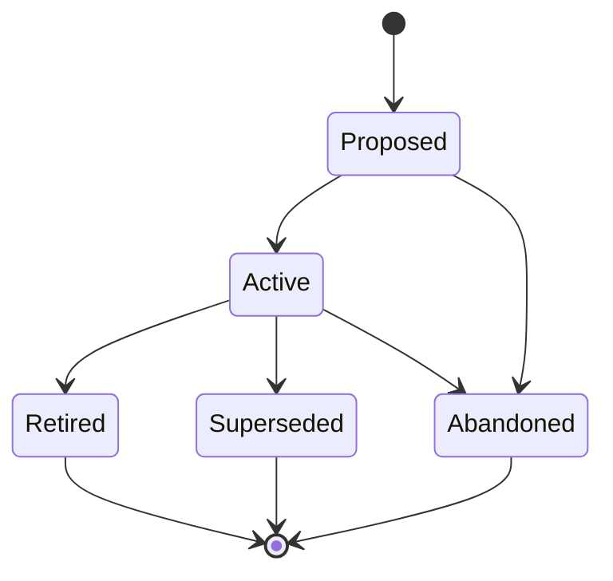

# Designs (DESIGN-NNN)

**Template:** [design-template.md.template](design-template.md.template)

**Lifecycle track: Standing**

A design artifact captures the interaction layer of a feature or system: screens, states, flows, wireframes, happy/sad paths, and UI decisions. Designs sit between Journeys (experience narratives) and Specs (implementation). They answer "what does the user see and do?" — not "how does the system work?" (Spec) or "what is the user's experience narrative?" (Journey).

- **Folder structure:** `docs/design/<Phase>/(DESIGN-NNN)-<Title>/` — always foldered because a single design may contain multiple document types (screen wireframes, flow diagrams, interactive mockup links, annotated screenshots).
  - Example: `docs/design/Active/(DESIGN-003)-Skill-Installation-Flow/`
  - When transitioning phases, **move the folder** to the new phase directory (e.g., `git mv docs/design/Proposed/(DESIGN-003)-Foo/ docs/design/Active/(DESIGN-003)-Foo/`).
  - Phase subdirectories: `Proposed/`, `Active/`, `Retired/`, `Superseded/`.
  - Primary file: `(DESIGN-NNN)-<Title>.md` — the design overview and entry point.
  - Supporting docs: individual screen wireframes, flow diagrams, state machines, annotated mockups, prototype links, asset inventories.
- **Scoping rule:** One Design per cohesive interaction surface or workflow. "The skill installation flow" is a Design. "The settings page" is a Design. If a Design covers multiple unrelated interaction surfaces, it should be split. The artifact it's linked to sets the natural boundary — a Design linked to an Epic covers that Epic's interaction surface; a Design linked to a Spec is narrower.
- Designs are *cross-cutting reference artifacts* — they link to Epics and Specs via `linked-artifacts` but are not owned by any single one. Multiple artifacts can reference the same Design.
- A Design is "Active" when stakeholders agree it represents the intended interaction. "Superseded" when a newer Design replaces it (link via `superseded-by:` in frontmatter). "Retired" when the interaction surface it describes no longer exists.
- **Workflow diagrams required:** Any Design that describes a workflow or multi-step process MUST include a mermaid flowchart (`flowchart TD` or `flowchart LR`). Sequence diagrams are optional and may supplement the flowchart but do not replace it.
  - **Syntax rules:** Node IDs must be descriptive snake_case (e.g., `detect_env`, `prompt_user`) — never single-letter IDs. All labels must be quoted (`["Label"]`, `|"yes"|`).
  - **Scope:** The flowchart shows the **decision spine** — user choices and the paths they lead to. If the user decides it, it's on the diagram. If something goes wrong, it belongs in the "Edge Cases and Error States" section as a table, not on the diagram. Optimize for the human visual system: a scannable diagram beats a comprehensive one.
  - **Multiple happy paths:** When a workflow has legitimate branches (e.g., container vs. microVM, sandbox management), show each as a branch off a decision diamond with its essential steps. Don't fully expand each branch — keep it to key steps and terminal nodes.
  - **Complex branches:** If a single branch is too complex to represent in a few nodes, give it its own flowchart in a subsection rather than bloating the main diagram.
- Designs are NOT Specs. They do not define API contracts, data models, or system behavior. If a Design starts accumulating technical implementation details, those belong in a Spec that references the Design.

## Design Intent section

The Design Intent section provides stable criteria against which to evaluate whether implementation changes constitute drift or intentional evolution. It contains three structured subsections:

- **Goals** answer "what experience are we trying to create?" — the desired user-facing outcome.
- **Constraints** are machine-checkable or reviewable boundaries that the design must respect.
- **Non-goals** prevent scope creep by explicitly recording what was decided against.

### Write-once convention

Design Intent is established when the DESIGN is created or transitions to Active. It is not updated when the mutable sections (flows, states, screens) evolve. If the intent itself fundamentally changes, Supersede the DESIGN and create a new one.

Write-once is enforced by agent convention, not tooling. The structured format (Goals/Constraints/Non-goals) makes unintentional edits obvious in code review.
