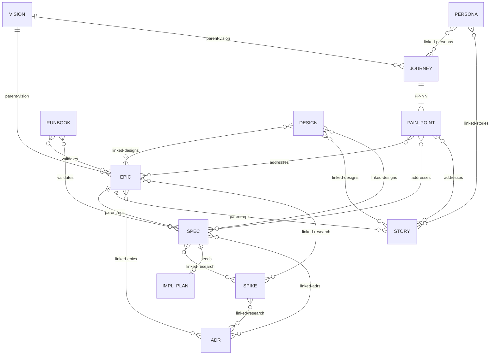

# Artifact Relationship Model

**Key:** Solid lines (`||--o{`) = mandatory hierarchy. Diamond lines (`}o--o{`) = informational cross-references. SPIKE can attach to any artifact type, not just SPEC. Any artifact can declare `depends-on:` blocking dependencies on any other artifact. Per-type frontmatter fields are defined in each type's template.
