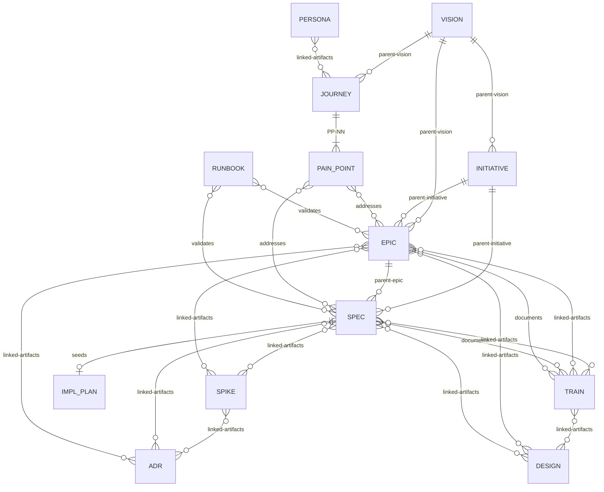

# Artifact Relationship Model



**11 artifact types in three lifecycle tracks:**

| Track | Types | Lifecycle |
|-------|-------|-----------|
| **Implementable** | SPEC | Proposed -> Ready -> In Progress -> Needs Manual Test -> Complete |
| **Container** | INITIATIVE, EPIC, SPIKE | Proposed -> Active -> Complete |
| **Standing** | VISION, JOURNEY, PERSONA, ADR, RUNBOOK, DESIGN, TRAIN | Proposed -> Active -> (Retired \| Superseded) |

**Universal terminal states** (available from any phase): Abandoned, Retired, Superseded.

**Key:** Solid lines (`||--o{`) = mandatory hierarchy. Diamond lines (`}o--o{`) = informational cross-references. SPIKE can attach to any artifact type, not just SPEC. Any artifact can declare `depends-on-artifacts:` blocking dependencies on any other artifact (spikes use `linked-artifacts` only). INITIATIVEs sit between VISION and EPIC — a SPEC may declare `parent-initiative` directly when no intermediate EPIC exists. Per-type frontmatter fields are defined in each type's template.

## Enriched linked-artifacts format

TRAIN artifacts (and any artifact linking to a TRAIN) may use enriched `linked-artifacts` entries with `rel` tags and optional commit pinning. Plain string entries remain valid and default to `rel: linked`.

```yaml
linked-artifacts:
  - artifact: SPEC-067
    rel: [documents]
    commit: abc1234
    verified: 2026-03-19
  - DESIGN-003              # plain string = rel: linked (default)
```

### Relationship vocabulary

| `rel` value | Direction | Meaning | Staleness tracking |
|-------------|-----------|---------|-------------------|
| `linked` | bidirectional | Informational cross-reference (default for plain strings) | No |
| `documents` | TRAIN → artifact | TRAIN content depends on the artifact's current behavior | Yes — `train-check.sh` diffs pinned commit against HEAD |
| `validates` | RUNBOOK → artifact | Runbook verifies the artifact's behavior | No |
| `addresses` | EPIC/SPEC → PAIN_POINT | Artifact resolves a Journey pain point | No |

Tools that parse `linked-artifacts` must handle both string and object entries. When reading object entries, extract `artifact`, `rel`, `commit`, and `verified` fields. Missing `rel` defaults to `["linked"]`.
